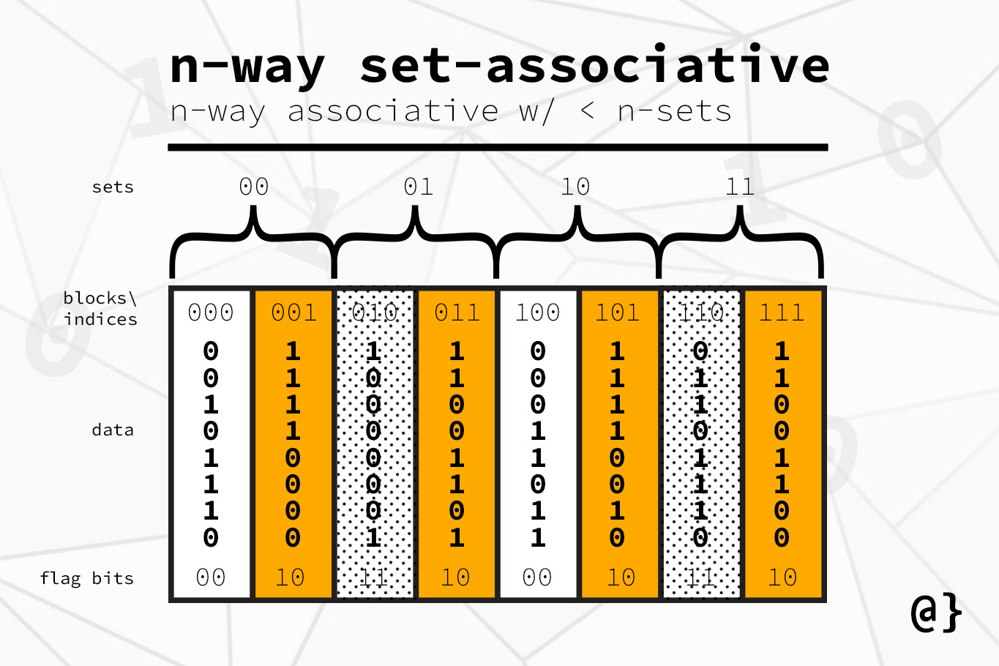

## Cache Simulator in C++

Cache memory is an integral part of our systems these days. They help us achieve speedup through storing frequently accessed information in them. They act as buffere between main memory and registers.
In this semester,through the course CSN-221,we have learnt the Processor, Cache part of Computer Architecture under Prof.Debiprasanna Sahoo. In this repo,we have attempted to simulate cache 
by writing a code in C++.
For this,we have taken LRU replacemnet policy as our block replacement policy. ALso we have made all the sizes of cache as well as indexing, block offset variable and ran tests on them on three benchmarks from memory traces
given by our professor.

<div align="center">
  
</div>

## LRU
LRU or least recently used algorithm is one of the best algorithms for cache block replacement. As evident from the name, LRU policy means in an index we remove the block which was accessed the earliest or whose recently used time is earlier than all the other 
blocks. To implement this we need to keep track of the times at which the blocks were accessed and there are many ways of doing this like using a counter which would be incremented each time it was not accessed and reset whenever it was accessed.


## Implementation of LRU
We instead of keeping track of count variable and wasting space as for each block this needs to be kept and incremented, we used an algorithm that just pushed the accessed block from back and removed whichever block which 
was present at the beginning whenever there was a miss and the new block was brought from main memory and added to the back of that and so on. 
## Implementation in C++
We used a vector to which we pushed the block tag whenever that particular block got a miss at the particular index. Whenever tehre was a hit we removed it from its place and appended to the end of the vector.
We also used a valid bit to know whether ethe tag stored inside the block is junk or data. Whenever we are adding block from main memory this bit is made 1 from 0. This way using vector and some basic operations
we were able to simulate cache in C++.
## Input Format
The input is given from the text file and the C++ code reads the text file and runs the simulation on the memory traces provided by [our prof](http://www.cs.utah.edu/~rajeev/usimm-v1.3.tar.gz). The input format is of the form Number of memory locations(T),ways (N)
and then the second line contains the tag bits(a), indexing bits(ibit), block offset bits(c). Then they are followed by T lines containing the memory locations.

## Steps to run
```
1. Run the cachemem.cpp file and input the information according to the format in the text file.
2. Record the outputs for further usage.
```

Our results can be visualized as below:
## Bar Graph

## Hitrate Table


## Contributors
Akula Koushik, Cheedu Praneeth Reddy, Pasala Veerasive, Ramavath Lalu, Uppala Vivek Narayan, Velavali Venkata Karthikeya Sai Vydhik.
## Contact Us
In case of any queries, please contact us at +91-7989425329 or mail us at viveknarayan.u@gmail.com.
